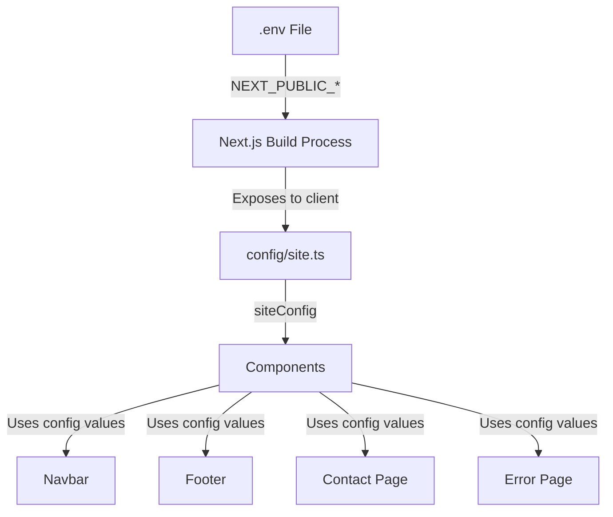

# Configuration Setup Guide

This guide explains how the project uses environment variables and the `config/site.ts` file to manage site-wide configuration.

## Overview

The project uses a centralized configuration system that reads values from environment variables. This allows you to easily customize project information, GitHub links, contact details, and developer information without modifying multiple files.

## Architecture



## Environment Variables

### File Locations
- **`.env`** - Contains your actual environment variables (not committed to git)
- **`.env.example`** - Template file showing required variables (committed to git)

### Variable Naming Convention

All environment variables that need to be accessed on the client side must use the `NEXT_PUBLIC_` prefix. This is a Next.js requirement that makes these variables available in the browser.

### Available Variables

#### Project Information
- `NEXT_PUBLIC_PROJECT_NAME` - The name of your project
- `NEXT_PUBLIC_PROJECT_DESCRIPTION` - A brief description of your project

#### GitHub Information
- `NEXT_PUBLIC_GITHUB_USERNAME` - Your GitHub username
- `NEXT_PUBLIC_GITHUB_REPO` - The repository name
- `NEXT_PUBLIC_GITHUB_URL` - Full URL to the repository
- `NEXT_PUBLIC_GITHUB_ISSUES_URL` - URL to the issues page
- `NEXT_PUBLIC_GITHUB_DISCUSSIONS_URL` - URL to the discussions page

#### Contact Information
- `NEXT_PUBLIC_CONTACT_EMAIL` - Contact email address
- `NEXT_PUBLIC_LINKEDIN_URL` - LinkedIn profile URL
- `NEXT_PUBLIC_TWITTER_URL` - Twitter/X profile URL

#### Developer Information
- `NEXT_PUBLIC_DEVELOPER_NAME` - Developer's name
- `NEXT_PUBLIC_DEVELOPER_WEBSITE` - Developer's personal website URL
- `NEXT_PUBLIC_DEVELOPER_GITHUB_URL` - Developer's GitHub profile URL

## Configuration File: config/site.ts

The `config/site.ts` file exports a `siteConfig` object that reads from environment variables and provides fallback values.

### Structure

```typescript
export const siteConfig = {
  // Project Information
  projectName: process.env.NEXT_PUBLIC_PROJECT_NAME || 'Markdown Typing SVG',
  projectDescription: process.env.NEXT_PUBLIC_PROJECT_DESCRIPTION || '...',

  // GitHub Information
  github: {
    username: process.env.NEXT_PUBLIC_GITHUB_USERNAME || 'yourusername',
    repo: process.env.NEXT_PUBLIC_GITHUB_REPO || 'markdown-typing-svg',
    url: process.env.NEXT_PUBLIC_GITHUB_URL || '...',
    issuesUrl: process.env.NEXT_PUBLIC_GITHUB_ISSUES_URL || '...',
    discussionsUrl: process.env.NEXT_PUBLIC_GITHUB_DISCUSSIONS_URL || '...',
  },

  // Contact Information
  contact: {
    email: process.env.NEXT_PUBLIC_CONTACT_EMAIL || 'contact@example.com',
    linkedinUrl: process.env.NEXT_PUBLIC_LINKEDIN_URL || '...',
    twitterUrl: process.env.NEXT_PUBLIC_TWITTER_URL || '...',
  },

  // Developer Information
  developer: {
    name: process.env.NEXT_PUBLIC_DEVELOPER_NAME || 'Your Name',
    website: process.env.NEXT_PUBLIC_DEVELOPER_WEBSITE || '...',
    githubUrl: process.env.NEXT_PUBLIC_DEVELOPER_GITHUB_URL || 'https://github.com/yourusername',
  },
};
```

## Usage in Components

Components import and use `siteConfig` to access configuration values:

### Example: Navbar Component

```typescript
import { siteConfig } from '@/config/site';

// Use in JSX
<span>{siteConfig.projectName}</span>
<a href={siteConfig.github.url}>GitHub</a>
```

### Example: Footer Component

```typescript
import { siteConfig } from '@/config/site';

// Use in JSX
<p>{siteConfig.projectDescription}</p>
<a href={siteConfig.contact.linkedinUrl}>LinkedIn</a>
<a href={siteConfig.developer.githubUrl}>GitHub (Developer Profile)</a>
```

### Example: Contact Page

```typescript
import { siteConfig } from '@/config/site';

// Use in JSX
<a href={`mailto:${siteConfig.contact.email}`}>
  {siteConfig.contact.email}
</a>
<a href={siteConfig.github.issuesUrl}>Report an issue</a>
```

## Components Using siteConfig

The following components use `siteConfig`:

1. **[`components/layout/Navbar.tsx`](../components/layout/Navbar.tsx)** - Displays project name and GitHub link
2. **[`components/layout/Footer.tsx`](../components/layout/Footer.tsx)** - Displays project info and social links
3. **[`app/contact/page.tsx`](../app/contact/page.tsx)** - Displays contact email and GitHub links
4. **[`app/error.tsx`](../app/error.tsx)** - Displays GitHub issues link

## Setup Instructions

### For New Projects

1. Copy `.env.example` to `.env`:
   ```bash
   cp .env.example .env
   ```

2. Edit `.env` with your actual values:
   ```bash
   # Project Information
   NEXT_PUBLIC_PROJECT_NAME=Your Project Name
   NEXT_PUBLIC_PROJECT_DESCRIPTION=Your project description

   # GitHub Information
   NEXT_PUBLIC_GITHUB_USERNAME=yourusername
   NEXT_PUBLIC_GITHUB_REPO=your-repo-name
   NEXT_PUBLIC_GITHUB_URL=https://github.com/yourusername/your-repo-name
   NEXT_PUBLIC_GITHUB_ISSUES_URL=https://github.com/yourusername/your-repo-name/issues
   NEXT_PUBLIC_GITHUB_DISCUSSIONS_URL=https://github.com/yourusername/your-repo-name/discussions

   # Contact Information
   NEXT_PUBLIC_CONTACT_EMAIL=your@email.com
   NEXT_PUBLIC_LINKEDIN_URL=https://linkedin.com/in/yourusername
   NEXT_PUBLIC_TWITTER_URL=https://twitter.com/yourusername

   # Developer Information
   NEXT_PUBLIC_DEVELOPER_NAME=Your Name
   NEXT_PUBLIC_DEVELOPER_WEBSITE=https://yourwebsite.com
   NEXT_PUBLIC_DEVELOPER_GITHUB_URL=https://github.com/yourusername
   ```

3. Restart the development server to load the new environment variables:
   ```bash
   npm run dev
   ```

### For Existing Projects

1. Update your `.env` file to use `NEXT_PUBLIC_` prefix for all variables
2. Ensure all variables match the names expected in `config/site.ts`
3. Restart the development server

## Important Notes

### Security Considerations

- **Never commit `.env` to version control** - It's already in `.gitignore`
- Only use `NEXT_PUBLIC_` prefix for non-sensitive data
- Sensitive data (API keys, secrets) should NOT use `NEXT_PUBLIC_` prefix

### Client vs Server Variables

| Prefix | Accessible On | Use Case |
|--------|---------------|----------|
| `NEXT_PUBLIC_` | Client & Server | Public URLs, names, descriptions |
| (no prefix) | Server only | API keys, database URLs, secrets |

### Build Process

Next.js builds the application with environment variables embedded at build time. Changes to `.env` require:

1. Restarting the development server
2. Rebuilding for production deployments

### TypeScript Support

The `config/site.ts` file exports a type definition:

```typescript
export type SiteConfig = typeof siteConfig;
```

This provides autocomplete and type checking when using `siteConfig` in your components.

## Troubleshooting

### Environment Variables Not Loading

If environment variables are not appearing in your application:

1. **Check variable names** - Ensure they match exactly (case-sensitive)
2. **Verify prefix** - Ensure client-side variables have `NEXT_PUBLIC_` prefix
3. **Restart server** - Environment variables are loaded at startup
4. **Check .gitignore** - Ensure `.env` is not being ignored incorrectly

### Values Showing Defaults

If you see default values instead of your configured values:

1. Verify `.env` file exists in the project root
2. Check for typos in variable names
3. Ensure no spaces around the `=` sign
4. Restart the development server

### TypeScript Errors

If TypeScript complains about missing properties:

1. Ensure you're importing from `@/config/site`
2. Check that the type definition matches your usage
3. Run `npm run build` to verify all types are correct

## Adding New Configuration

To add new configuration values:

1. Add the environment variable to `.env` and `.env.example`
2. Add the variable to `config/site.ts` with appropriate fallback
3. Import and use `siteConfig` in your components

### Example: Adding a New Social Link

**1. Update `.env`:**
```env
NEXT_PUBLIC_SOCIAL_YOUTUBE_URL=https://youtube.com/@yourchannel
```

**2. Update `.env.example`:**
```env
NEXT_PUBLIC_SOCIAL_YOUTUBE_URL=https://youtube.com/@yourchannel
```

**3. Update `config/site.ts`:**
```typescript
contact: {
  // ... existing fields
  youtubeUrl: process.env.NEXT_PUBLIC_SOCIAL_YOUTUBE_URL || 'https://youtube.com/@yourchannel',
},
```

**4. Use in component:**
```typescript
<a href={siteConfig.contact.youtubeUrl}>YouTube</a>
```

## Related Files

- [`.env`](../.env) - Your environment variables (not in git)
- [`.env.example`](../.env.example) - Environment variable template
- [`config/site.ts`](../config/site.ts) - Configuration file
- [`.gitignore`](../.gitignore) - Ensures `.env` is not committed

## Summary

The configuration system provides:

✅ Centralized configuration management  
✅ Environment-based customization  
✅ Type-safe access via TypeScript  
✅ Fallback values for development  
✅ Easy deployment to different environments  

For questions or issues, please refer to the project's [GitHub repository](https://github.com/montasim/markdown-typing-svg).
