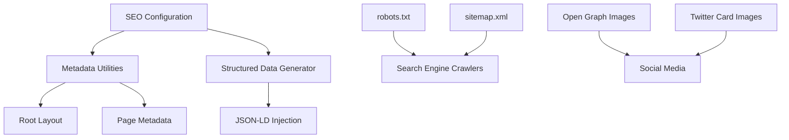

# SEO Implementation Plan for Markdown Typing SVG

## Overview

This plan outlines the comprehensive SEO implementation for the Markdown Typing SVG application to improve search engine visibility, user engagement, and organic traffic.

**Production URL:** https://markdown-typing-svg.netlify.app/

**Target Audience:** Both developers and general users looking to create animated SVGs for GitHub READMEs, profiles, and other platforms.

## Current SEO Status Analysis

### Existing SEO Elements
- ✅ Basic metadata in root layout (title, description, keywords)
- ✅ Semantic HTML structure
- ✅ Responsive design

### Missing SEO Elements
- ❌ Page-specific metadata
- ❌ Open Graph tags for social sharing
- ❌ Twitter Card tags
- ❌ Structured data (JSON-LD)
- ❌ Canonical URLs
- ❌ robots.txt
- ❌ sitemap.xml
- ❌ Meta descriptions for individual pages
- ❌ Social sharing images

## Implementation Architecture



## Implementation Tasks

### 1. Centralized SEO Configuration (`config/seo.ts`)

Create a centralized configuration file containing:
- Site-wide SEO settings
- Default metadata
- Social media configuration
- Structured data schemas
- Keyword strategy

**Key Elements:**
```typescript
export const seoConfig = {
  siteUrl: 'https://markdown-typing-svg.netlify.app',
  siteName: 'Markdown Typing SVG',
  defaultTitle: 'Markdown Typing SVG - Create Animated SVGs for Your README',
  defaultDescription: 'Create beautiful animated typing SVGs for your GitHub README, profiles, and more. Fully customizable with live preview.',
  defaultKeywords: [
    'typing svg',
    'animated svg',
    'github readme',
    'markdown',
    'svg generator',
    'typing animation',
    'github profile',
    'developer tools',
    'svg creator',
    'animated text'
  ],
  social: {
    twitterHandle: '@yourusername',
    ogImage: '/og-image.png',
    twitterImage: '/twitter-image.png'
  }
}
```

### 2. Metadata Helper Utilities (`lib/seo/metadata.ts`)

Create helper functions to generate consistent metadata across pages:
- `generateMetadata()` - Generates Next.js Metadata object
- `generateOpenGraph()` - Generates Open Graph tags
- `generateTwitterCard()` - Generates Twitter Card tags
- `generateCanonical()` - Generates canonical URL

### 3. Structured Data Generator (`lib/seo/structured-data.ts`)

Create utilities for JSON-LD structured data:
- `generateOrganizationSchema()` - Organization information
- `generateWebSiteSchema()` - Website information
- `generateWebPageSchema()` - Page-specific information
- `generateSoftwareApplicationSchema()` - Software application schema
- `generateFAQPageSchema()` - FAQ page schema
- `generateBreadcrumbListSchema()` - Breadcrumb navigation

### 4. Root Layout Enhancement (`app/layout.tsx`)

Update root layout with:
- Comprehensive default metadata
- Open Graph tags
- Twitter Card tags
- Canonical URL
- Favicon links
- Theme color
- Viewport optimization

### 5. Page-Specific Metadata

#### Home Page (`app/page.tsx`)
- Title: "Markdown Typing SVG - Create Animated SVGs for Your README"
- Description: "Free online tool to create beautiful animated typing SVGs for GitHub README, profiles, and more. Fully customizable with live preview, dark mode, and instant export."
- Keywords: typing svg, animated svg, github readme, svg generator, typing animation
- Structured Data: SoftwareApplication, WebSite, FAQPage

#### Contact Page (`app/contact/page.tsx`)
- Title: "Contact Us - Markdown Typing SVG"
- Description: "Get in touch with the Markdown Typing SVG team. Report issues, start discussions, or ask questions about our SVG generator tool."
- Keywords: contact, support, help, feedback, issues
- Structured Data: WebPage, ContactPage

#### Privacy Policy (`app/privacy/page.tsx`)
- Title: "Privacy Policy - Markdown Typing SVG"
- Description: "Learn how Markdown Typing SVG collects, uses, and protects your data. Our commitment to privacy and data security."
- Keywords: privacy policy, data protection, terms, legal
- Structured Data: WebPage

#### Terms of Service (`app/terms/page.tsx`)
- Title: "Terms of Service - Markdown Typing SVG"
- Description: "Terms of service for Markdown Typing SVG. Read our usage guidelines, license terms, and user agreements."
- Keywords: terms of service, terms, legal, license, agreement
- Structured Data: WebPage

#### 404 Page (`app/not-found.tsx`)
- Title: "Page Not Found - Markdown Typing SVG"
- Description: "The page you're looking for doesn't exist. Return to the Markdown Typing SVG home page to create animated SVGs."
- Keywords: 404, not found, error

### 6. robots.txt (`public/robots.txt`)

```
User-agent: *
Allow: /
Disallow: /api/

Sitemap: https://markdown-typing-svg.netlify.app/sitemap.xml
```

### 7. Dynamic Sitemap (`app/sitemap.ts`)

Create Next.js sitemap generator for:
- All static pages
- Dynamic pages (if any)
- Priority and lastModified values
- Alternate language support (if needed)

### 8. Image Sitemap (`app/sitemap-images.ts`)

Create sitemap for images:
- Open Graph images
- Twitter Card images
- Example SVG images

### 9. JSON-LD Structured Data

#### Home Page
- SoftwareApplication schema
- WebSite schema
- FAQPage schema
- BreadcrumbList schema

#### Legal Pages
- WebPage schema
- Organization schema

### 10. Open Graph and Twitter Card Images

Create social sharing images:
- `public/og-image.png` (1200x630px)
- `public/twitter-image.png` (1200x600px)

Design considerations:
- Include app name and tagline
- Show example SVG animation
- Use brand colors
- Clear, readable text

### 11. Heading Hierarchy Optimization

Ensure proper heading structure:
- H1: One per page, main title
- H2: Section headings
- H3: Subsection headings
- H4-H6: Nested content

Current structure analysis:
- Home page: H1 present, H2 for sections ✅
- Contact page: H1 present, H2 for sections ✅
- Legal pages: H1 present, H2 for sections ✅

### 12. Internal Linking

Add internal links between pages:
- Footer already contains links to legal pages ✅
- Add breadcrumb navigation
- Add related content links
- Add navigation between legal pages

### 13. Environment Variables Update

Update `.env` and `.env.example` with:
```
NEXT_PUBLIC_SITE_URL=https://markdown-typing-svg.netlify.app
NEXT_PUBLIC_SITE_NAME=Markdown Typing SVG
NEXT_PUBLIC_TWITTER_HANDLE=@yourusername
```

### 14. Content Optimization

#### Home Page
- Add more descriptive alt text for images
- Ensure keyword density is natural
- Add more internal links
- Optimize feature descriptions for search intent

#### Legal Pages
- Ensure clear, readable content
- Add internal links to related sections
- Optimize for legal-related searches

## SEO Best Practices Implementation

### Technical SEO
- ✅ Next.js 16 with App Router (SEO-friendly)
- ✅ Server-side rendering
- ✅ Static generation where possible
- ✅ Fast page load times
- ✅ Mobile-responsive design
- ✅ HTTPS (production)
- ⬜ Canonical URLs
- ⬜ robots.txt
- ⬜ sitemap.xml

### On-Page SEO
- ⬜ Optimized title tags
- ⬜ Meta descriptions
- ⬜ Heading hierarchy
- ⬜ URL structure
- ⬜ Internal linking
- ⬜ Image alt text
- ⬜ Schema markup

### Off-Page SEO
- Social media sharing (Open Graph, Twitter Cards)
- Backlink opportunities (GitHub, developer communities)

## Keyword Strategy

### Primary Keywords
- "typing svg"
- "animated svg"
- "github readme svg"
- "svg generator"

### Secondary Keywords
- "typing animation"
- "github profile svg"
- "animated text svg"
- "markdown svg"
- "svg creator"

### Long-tail Keywords
- "how to add typing animation to github readme"
- "create animated svg for github profile"
- "best svg generator for developers"
- "free typing svg tool"

## Performance Considerations

- Keep metadata lightweight
- Optimize social sharing images
- Use Next.js Image component
- Implement proper caching headers
- Minimize JavaScript bundle size

## Monitoring and Validation

### Tools to Use
- Google Search Console
- Google Rich Results Test
- Twitter Card Validator
- Facebook Sharing Debugger
- Lighthouse
- PageSpeed Insights

### Validation Checklist
- [ ] All pages have unique titles
- [ ] All pages have meta descriptions
- [ ] Open Graph tags validate
- [ ] Twitter Card tags validate
- [ ] Structured data validates
- [ ] Canonical URLs are correct
- [ ] robots.txt is accessible
- [ ] sitemap.xml is valid
- [ ] No broken internal links
- [ ] All images have alt text

## Success Metrics

- Improved search rankings for target keywords
- Increased organic traffic
- Higher click-through rates from search results
- Better social media engagement
- Improved page load scores
- Enhanced user experience

## Next Steps

1. Review and approve this plan
2. Switch to Code mode for implementation
3. Implement each task in order
4. Test and validate after each major component
5. Deploy and monitor results

## Files to Create/Modify

### New Files
- `config/seo.ts` - Centralized SEO configuration
- `lib/seo/metadata.ts` - Metadata helper utilities
- `lib/seo/structured-data.ts` - Structured data generator
- `public/robots.txt` - Robots.txt file
- `app/sitemap.ts` - Dynamic sitemap
- `app/sitemap-images.ts` - Image sitemap
- `public/og-image.png` - Open Graph image
- `public/twitter-image.png` - Twitter Card image

### Modified Files
- `app/layout.tsx` - Enhanced root layout
- `app/page.tsx` - Home page metadata
- `app/contact/page.tsx` - Contact page metadata
- `app/privacy/page.tsx` - Privacy page metadata
- `app/terms/page.tsx` - Terms page metadata
- `app/not-found.tsx` - 404 page metadata
- `.env` - Environment variables
- `.env.example` - Environment variables template

## Timeline

The implementation can be completed in the following phases:

**Phase 1: Foundation** (Tasks 1-4)
- Create SEO configuration and utilities
- Set up structured data generators

**Phase 2: Core Metadata** (Tasks 5-10)
- Update all pages with metadata
- Create robots.txt and sitemap

**Phase 3: Advanced SEO** (Tasks 11-16)
- Add structured data
- Create social sharing images
- Optimize content structure

**Phase 4: Finalization** (Tasks 17-20)
- Internal linking
- Environment configuration
- Testing and validation
