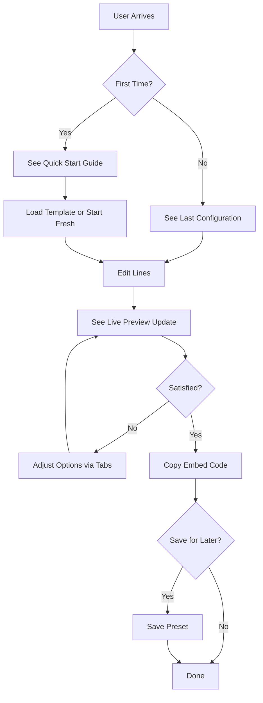

# UI/UX Reorganization Plan for Markdown Typing SVG

## Executive Summary

This document outlines a comprehensive reorganization of the root page UI based on industry-standard UI/UX principles. The current implementation has several usability issues that can be improved through better information architecture, visual hierarchy, and progressive disclosure.

---

## Current UI Analysis

### Current Layout Structure

```
┌─────────────────────────────────────────────────────────────────┐
│ Header: Title + Subtitle                                         │
├─────────────────────────────────────────────────────────────────┤
│ ┌─────────────────────┐ ┌─────────────────────────────────────┐ │
│ │ Left Panel          │ │ Right Panel                         │ │
│ │                     │ │                                     │ │
│ │ 1. Lines Editor     │ │ 1. Preview (with undo/redo)         │ │
│ │ 2. Options Panel    │ │ 2. My Presets (collapsed)            │ │
│ │    - Typography     │ │ 3. Embed Code                        │ │
│ │    - Colors         │ │    - Markdown                        │ │
│ │    - Effects        │ │    - HTML                            │ │
│ │ 3. Advanced Options │ │    - Direct URL                      │ │
│ │    (collapsed)      │ │ 4. Platform Presets (collapsed)      │ │
│ │ 4. Text Templates   │ │                                     │ │
│ │    (collapsed)      │ │                                     │ │
│ └─────────────────────┘ └─────────────────────────────────────┘ │
├─────────────────────────────────────────────────────────────────┤
│ Features Section (9 feature cards)                               │
├─────────────────────────────────────────────────────────────────┤
│ FAQ Section (8 accordion items)                                  │
└─────────────────────────────────────────────────────────────────┘
```

### Identified UI/UX Issues

#### 1. Information Architecture Issues

| Issue | Severity | Description |
|-------|----------|-------------|
| Hidden key features | High | Templates, Presets, and Advanced Options are collapsed by default |
| Poor visual hierarchy | High | Preview (most important) is secondary to options panel |
| Scattered actions | Medium | Import/Export/Reset buried in Options header |
| No onboarding | High | No guidance for first-time users |

#### 2. Visual Hierarchy Issues

| Issue | Severity | Description |
|-------|----------|-------------|
| Preview not prominent | High | Users want to see what they're creating |
| No primary action | Medium | No clear "Create" or "Generate" button |
| Equal weight on all options | Medium | Typography, Colors, Effects all visible at once |

#### 3. Navigation/Flow Issues

| Issue | Severity | Description |
|-------|----------|-------------|
| Excessive whitespace | Medium | `mt-64` margins create unnecessary scrolling |
| No workflow guidance | High | Users don't know where to start |
| Bottom sections hidden | Low | Features/FAQ require scrolling past editor |

#### 4. Progressive Disclosure Issues

| Issue | Severity | Description |
|-------|----------|-------------|
| Cognitive overload | High | All options visible simultaneously |
| No grouping by frequency | Medium | Common and advanced options mixed |
| No quick-start mode | High | No way to get started quickly |

#### 5. Accessibility Issues

| Issue | Severity | Description |
|-------|----------|-------------|
| Missing ARIA labels | Medium | Collapsible sections lack proper attributes |
| No keyboard navigation hints | Low | Keyboard shortcuts not visible |
| Color-only indicators | Low | Some states use only color |

---

## Proposed Reorganization

### New Layout Structure (Desktop - Large Screens)

```
┌─────────────────────────────────────────────────────────────────────────────────┐
│ Header: Title + Subtitle + Quick Actions Bar                                   │
│ ┌─────────────────────────────────────────────────────────────────────────────┐ │
│ │ [Templates] [Presets] [Import] [Export] [Reset]                            │ │
│ └─────────────────────────────────────────────────────────────────────────────┘ │
├─────────────────────────────────────────────────────────────────────────────────┤
│ ┌─────────────────────────────────────────────────────────────────────────────┐ │
│ │                          PREVIEW (Sticky, Prominent)                        │ │
│ │                    ┌─────────────────────────────┐                          │ │
│ │                    │   [SVG Preview Image]       │                          │ │
│ │                    └─────────────────────────────┘                          │ │
│ │                    [Undo] [Redo] [Download ▼] [Show Border]                 │ │
│ └─────────────────────────────────────────────────────────────────────────────┘ │
├─────────────────────────────────────────────────────────────────────────────────┤
│ ┌─────────────────────────────────────┐ ┌─────────────────────────────────────┐ │
│ │ Left Panel: INPUT & QUICK OPTIONS   │ │ Right Panel: ADVANCED OPTIONS        │ │
│ │                                     │ │                                     │ │
│ │ ┌─────────────────────────────────┐ │ │ ┌─────────────────────────────────┐ │ │
│ │ │ Lines Editor (Primary Input)    │ │ │ │ Quick Settings (Tabs)           │ │ │
│ │ │                                 │ │ │ │ [Typography] [Colors] [Effects]│ │ │
│ │ │ [Add Line] [Bulk Edit]          │ │ │ └─────────────────────────────────┘ │ │
│ │ │                                 │ │ │                                 │ │ │
│ │ │ Line 1: [________________] [×]  │ │ │ ┌─────────────────────────────────┐ │ │
│ │ │ Line 2: [________________] [×]  │ │ │ │ Typography Content             │ │ │
│ │ │ Line 3: [________________] [×]  │ │ │ │ - Font Family                   │ │ │
│ │ └─────────────────────────────────┘ │ │ │ - Font Size                     │ │ │
│ │                                     │ │ │ - Letter Spacing                │ │ │
│ │ ┌─────────────────────────────────┐ │ │ └─────────────────────────────────┘ │ │
│ │ │ Quick Actions                   │ │ │                                 │ │ │
│ │ │ [Load Template ▼] [Save Preset] │ │ │ ┌─────────────────────────────────┐ │ │
│ │ └─────────────────────────────────┘ │ │ │ │ Advanced Options (Collapsible) │ │ │
│ │                                     │ │ │                                 │ │ │
│ │                                     │ │ │ Dimensions                      │ │ │
│ │                                     │ │ │ Alignment                       │ │ │
│ │                                     │ │ │ Animation                       │ │ │
│ │                                     │ │ │ Cursor Settings                 │ │ │
│ │                                     │ │ └─────────────────────────────────┘ │ │
│ └─────────────────────────────────────┘ └─────────────────────────────────────┘ │
├─────────────────────────────────────────────────────────────────────────────────┤
│ ┌─────────────────────────────────────────────────────────────────────────────┐ │
│ │ EMBED CODE & EXPORT                                                        │ │
│ │ ┌─────────────────────────────────────────────────────────────────────────┐ │ │
│ │ │ Markdown: [____________________________] [Copy]                        │ │ │
│ │ │ HTML:     [____________________________] [Copy]                        │ │ │
│ │ │ URL:      [____________________________] [Copy]                        │ │ │
│ │ └─────────────────────────────────────────────────────────────────────────┘ │ │
│ │ Platform Presets: [GitHub] [GitLab] [Discord] [Slack] [Notion] [HTML]   │ │
│ └─────────────────────────────────────────────────────────────────────────────┘ │
├─────────────────────────────────────────────────────────────────────────────────┤
│ Features Section (Compact, 3 columns)                                          │
├─────────────────────────────────────────────────────────────────────────────────┤
│ FAQ Section (Accordion)                                                        │
└─────────────────────────────────────────────────────────────────────────────────┘
```

### New Layout Structure (Tablet - Medium Screens)

```
┌─────────────────────────────────────────────────────────────────┐
│ Header + Quick Actions Bar                                        │
├─────────────────────────────────────────────────────────────────┤
│ PREVIEW (Prominent)                                               │
│ ┌─────────────────────────────────────────────────────────────┐ │
│ │                     [SVG Preview Image]                      │ │
│ │              [Undo] [Redo] [Download ▼]                     │ │
│ └─────────────────────────────────────────────────────────────┘ │
├─────────────────────────────────────────────────────────────────┤
│ ┌─────────────────────────────────────────────────────────────┐ │
│ │ Lines Editor (Primary Input)                                │ │
│ │ [Add Line] [Bulk Edit] [Load Template ▼] [Save Preset]       │ │
│ │ Line 1: [________________] [×]                               │ │
│ │ Line 2: [________________] [×]                               │ │
│ └─────────────────────────────────────────────────────────────┘ │
├─────────────────────────────────────────────────────────────────┤
│ Quick Settings (Horizontal Tabs)                                │
│ [Typography] [Colors] [Effects] [Advanced]                      │
│ ┌─────────────────────────────────────────────────────────────┐ │
│ │ [Typography Content]                                         │ │
│ └─────────────────────────────────────────────────────────────┘ │
├─────────────────────────────────────────────────────────────────┤
│ Embed Code & Platform Presets                                   │
├─────────────────────────────────────────────────────────────────┤
│ Features & FAQ (Compact)                                         │
└─────────────────────────────────────────────────────────────────┘
```

### New Layout Structure (Mobile - Small Screens)

```
┌─────────────────────────────────────────┐
│ Header                                   │
│ [Templates] [Presets] [⋮]               │
├─────────────────────────────────────────┤
│ PREVIEW (Top, Sticky)                   │
│ ┌─────────────────────────────────────┐ │
│ │         [SVG Preview Image]          │ │
│ │      [Download ▼] [Show Border]     │ │
│ └─────────────────────────────────────┘ │
├─────────────────────────────────────────┤
│ Lines Editor                            │
│ [Add Line] [Bulk Edit]                  │
│ Line 1: [________________] [×]          │
│ Line 2: [________________] [×]          │
├─────────────────────────────────────────┤
│ Quick Settings (Accordion)              │
│ ▼ Typography                            │
│ ▼ Colors                                │
│ ▼ Effects                               │
│ ▼ Advanced Options                      │
├─────────────────────────────────────────┤
│ Embed Code                              │
│ Markdown: [Copy]                        │
│ HTML: [Copy]                            │
├─────────────────────────────────────────┤
│ Platform Presets (Horizontal scroll)    │
│ [GitHub] [GitLab] [Discord] ...         │
├─────────────────────────────────────────┤
│ Features & FAQ                          │
└─────────────────────────────────────────┘
```

---

## Detailed Changes

### 1. Header & Quick Actions Bar

**Current:**
```tsx
<div className="mb-6 sm:mb-8">
  <h1 className="text-3xl sm:text-4xl font-bold text-slate-900 dark:text-slate-50">Markdown Typing SVG</h1>
  <p className="text-sm sm:text-base text-slate-600 dark:text-slate-400">
    Create animated typing SVGs for your GitHub README
  </p>
</div>
```

**Proposed:**
```tsx
<div className="mb-4 sm:mb-6">
  <div className="flex flex-col sm:flex-row sm:items-center sm:justify-between gap-4">
    <div>
      <h1 className="text-2xl sm:text-3xl font-bold text-slate-900 dark:text-slate-50">Markdown Typing SVG</h1>
      <p className="text-sm sm:text-base text-slate-600 dark:text-slate-400">
        Create animated typing SVGs for your GitHub README
      </p>
    </div>
    <div className="flex flex-wrap gap-2">
      <Button variant="outline" size="sm" onClick={() => setShowTemplates(true)}>
        <Sparkles className="w-4 h-4 mr-2" />
        Templates
      </Button>
      <Button variant="outline" size="sm" onClick={() => setShowPresets(true)}>
        <Gauge className="w-4 h-4 mr-2" />
        Presets
      </Button>
      <Button variant="outline" size="sm" onClick={() => document.getElementById('import-config')?.click()}>
        <Upload className="w-4 h-4 mr-2" />
        Import
      </Button>
      <Button variant="outline" size="sm" onClick={exportConfig}>
        <Download className="w-4 h-4 mr-2" />
        Export
      </Button>
      <Button variant="outline" size="sm" onClick={handleReset}>
        <Undo className="w-4 h-4 mr-2" />
        Reset
      </Button>
    </div>
  </div>
</div>
```

**Benefits:**
- Quick actions are immediately visible
- Icons improve discoverability
- Better visual grouping of related actions

---

### 2. Preview Section (Prominent & Sticky)

**Current:**
```tsx
<Card>
  <CardHeader>
    <div className="flex items-center justify-between">
      <div className="flex items-center gap-2">
        <CardTitle className="text-base sm:text-lg">Preview</CardTitle>
        <div className="flex gap-1">
          <Button variant="ghost" size="icon" onClick={() => undo()} disabled={!canUndo} title="Undo (Ctrl+Z)">
            <Undo className="w-4 h-4" />
          </Button>
          <Button variant="ghost" size="icon" onClick={() => redo()} disabled={!canRedo} title="Redo (Ctrl+Y)">
            <Redo className="w-4 h-4" />
          </Button>
        </div>
      </div>
      <div className="relative">
        <Button variant="outline" size="sm" onClick={() => setShowDownloadDropdown(!showDownloadDropdown)} className="gap-2">
          <Download className="w-4 h-4" />
          Download
          <ChevronDown className={`w-4 h-4 transition-transform ${showDownloadDropdown ? 'rotate-180' : ''}`} />
        </Button>
        {/* Download dropdown */}
      </div>
    </div>
  </CardHeader>
  <CardContent className="space-y-4">
    <div className="relative svg-preview-container">
      
    </div>
    <div className="flex items-center space-x-2">
      <Switch id="show-border" checked={showBorder} onCheckedChange={setShowBorder} />
      <Label htmlFor="show-border" className="text-sm sm:text-base">Show border</Label>
    </div>
  </CardContent>
</Card>
```

**Proposed:**
```tsx
<div className="sticky top-4 z-20 mb-6">
  <Card className="shadow-lg border-2 border-slate-200 dark:border-slate-700">
    <CardHeader className="pb-3">
      <div className="flex items-center justify-between">
        <div className="flex items-center gap-2">
          <div className="flex items-center gap-1.5 bg-indigo-100 dark:bg-indigo-900/30 px-2 py-1 rounded">
            <Eye className="w-4 h-4 text-indigo-600 dark:text-indigo-400" />
            <span className="text-xs font-semibold text-indigo-700 dark:text-indigo-300">PREVIEW</span>
          </div>
          <div className="flex gap-1">
            <Button variant="ghost" size="icon" onClick={() => undo()} disabled={!canUndo} title="Undo (Ctrl+Z)">
              <Undo className="w-4 h-4" />
            </Button>
            <Button variant="ghost" size="icon" onClick={() => redo()} disabled={!canRedo} title="Redo (Ctrl+Y)">
              <Redo className="w-4 h-4" />
            </Button>
          </div>
        </div>
        <div className="flex gap-2">
          <Button variant="outline" size="sm" onClick={() => setShowDownloadDropdown(!showDownloadDropdown)} className="gap-2">
            <Download className="w-4 h-4" />
            Download
            <ChevronDown className={`w-4 h-4 transition-transform ${showDownloadDropdown ? 'rotate-180' : ''}`} />
          </Button>
        </div>
      </div>
    </CardHeader>
    <CardContent className="space-y-4">
      <div className="relative bg-slate-50 dark:bg-slate-900/50 rounded-lg p-4">
        
      </div>
      <div className="flex items-center justify-between">
        <div className="flex items-center space-x-2">
          <Switch id="show-border" checked={showBorder} onCheckedChange={setShowBorder} />
          <Label htmlFor="show-border" className="text-sm">Show border</Label>
        </div>
        <div className="text-xs text-slate-500 dark:text-slate-400">
          {options.width}×{options.height}px
        </div>
      </div>
    </CardContent>
  </Card>
</div>
```

**Benefits:**
- Sticky positioning keeps preview always visible while scrolling
- Visual badge makes it clear this is the preview
- Better background contrast
- Dimensions displayed for reference

---

### 3. Lines Editor (Primary Input)

**Current:**
```tsx
<Card>
  <CardHeader>
    <div className="flex items-center justify-between">
      <CardTitle>Add your text</CardTitle>
      <div className="flex gap-2">
        <Button variant="outline" size="sm" onClick={toggleBulkEdit} title={showBulkEdit ? 'Individual edit' : 'Bulk edit'}>
          {showBulkEdit ? <List className="w-4 h-4" /> : <Edit2 className="w-4 h-4" />}
        </Button>
        <Button onClick={handleAddLine} size="sm">
          <Plus className="w-4 h-4 mr-2" />
          Add line
        </Button>
      </div>
    </div>
  </CardHeader>
  <CardContent className="space-y-3">
    {/* Lines content */}
  </CardContent>
</Card>
```

**Proposed:**
```tsx
<Card className="border-2 border-indigo-200 dark:border-indigo-800">
  <CardHeader className="bg-indigo-50/50 dark:bg-indigo-950/30">
    <div className="flex flex-col sm:flex-row sm:items-center sm:justify-between gap-3">
      <div className="flex items-center gap-2">
        <Type className="w-5 h-5 text-indigo-600 dark:text-indigo-400" />
        <CardTitle className="text-lg">Add your text</CardTitle>
      </div>
      <div className="flex flex-wrap gap-2">
        <Button variant="outline" size="sm" onClick={() => setShowTemplates(!showTemplates)} className="gap-1.5">
          <Sparkles className="w-4 h-4" />
          Templates
        </Button>
        <Button variant="outline" size="sm" onClick={toggleBulkEdit} title={showBulkEdit ? 'Individual edit' : 'Bulk edit'} className="gap-1.5">
          {showBulkEdit ? <List className="w-4 h-4" /> : <Edit2 className="w-4 h-4" />}
          {showBulkEdit ? 'Individual' : 'Bulk'}
        </Button>
        <Button onClick={handleAddLine} size="sm" className="gap-1.5">
          <Plus className="w-4 h-4" />
          Add line
        </Button>
      </div>
    </div>
  </CardHeader>
  <CardContent className="space-y-3">
    {/* Lines content */}
  </CardContent>
</Card>
```

**Benefits:**
- Visual distinction as primary input area
- Templates button more discoverable
- Better labeling for bulk/individual toggle

---

### 4. Options Panel with Tabs

**Current:**
```tsx
<Card>
  <CardHeader>
    <div className="flex items-center justify-between">
      <CardTitle>Options</CardTitle>
      <div className="flex gap-2">
        <Button variant="outline" size="sm" onClick={() => document.getElementById('import-config')?.click()}>Import</Button>
        <Button variant="outline" size="sm" onClick={exportConfig}>Export</Button>
        <Button variant="outline" size="sm" onClick={handleReset}>Reset</Button>
      </div>
    </div>
  </CardHeader>
  <CardContent className="space-y-6">
    {/* Typography */}
    {/* Colors */}
    {/* Effects */}
  </CardContent>
</Card>
```

**Proposed:**
```tsx
<Card>
  <CardHeader>
    <CardTitle className="flex items-center gap-2">
      <Settings className="w-5 h-5" />
      Customize Your SVG
    </CardTitle>
  </CardHeader>
  <CardContent>
    {/* Tab Navigation */}
    <div className="flex flex-wrap gap-1 mb-6 border-b border-slate-200 dark:border-slate-700">
      {[
        { id: 'typography', label: 'Typography', icon: Type },
        { id: 'colors', label: 'Colors', icon: Palette },
        { id: 'effects', label: 'Effects', icon: Sparkles },
        { id: 'advanced', label: 'Advanced', icon: Settings },
      ].map((tab) => {
        const Icon = tab.icon;
        return (
          <button
            key={tab.id}
            onClick={() => setActiveTab(tab.id)}
            className={`flex items-center gap-1.5 px-3 py-2 text-sm font-medium border-b-2 transition-colors ${
              activeTab === tab.id
                ? 'border-indigo-500 text-indigo-600 dark:text-indigo-400'
                : 'border-transparent text-slate-600 dark:text-slate-400 hover:text-slate-900 dark:hover:text-slate-200'
            }`}
          >
            <Icon className="w-4 h-4" />
            {tab.label}
          </button>
        );
      })}
    </div>

    {/* Tab Content */}
    {activeTab === 'typography' && (
      <div className="space-y-4">
        {/* Typography content */}
      </div>
    )}
    {activeTab === 'colors' && (
      <div className="space-y-4">
        {/* Colors content */}
      </div>
    )}
    {activeTab === 'effects' && (
      <div className="space-y-4">
        {/* Effects content */}
      </div>
    )}
    {activeTab === 'advanced' && (
      <div className="space-y-4">
        {/* Advanced content */}
      </div>
    )}
  </CardContent>
</Card>
```

**Benefits:**
- Progressive disclosure reduces cognitive load
- Clear visual organization
- Icons improve discoverability
- Mobile-friendly (tabs stack on small screens)

---

### 5. Embed Code Section (Consolidated)

**Current:**
```tsx
<Card>
  <CardHeader>
    <CardTitle className="text-base sm:text-lg">Embed Code</CardTitle>
  </CardHeader>
  <CardContent className="space-y-4">
    <div className="space-y-4">
      <div className="flex flex-col sm:flex-row sm:items-center sm:justify-between gap-2">
        <Label htmlFor="markdown" className="text-sm sm:text-base block mb-3">Markdown</Label>
        <Button variant="outline" size="sm" onClick={() => copyToClipboard(markdown)} className="w-full sm:w-auto">
          Copy
        </Button>
      </div>
      <pre className="bg-slate-100 dark:bg-slate-900 p-3 sm:p-4 rounded-lg w-full text-xs sm:text-sm overflow-x-auto whitespace-pre-wrap break-all">
        <code id="markdown">{markdown}</code>
      </pre>
    </div>
    {/* HTML and URL sections similarly */}
  </CardContent>
</Card>
```

**Proposed:**
```tsx
<Card>
  <CardHeader>
    <CardTitle className="flex items-center gap-2">
      <Copy className="w-5 h-5" />
      Embed Code
    </CardTitle>
  </CardHeader>
  <CardContent className="space-y-4">
    {/* Tab-based code display */}
    <div className="flex gap-1 mb-3">
      {[
        { id: 'markdown', label: 'Markdown', icon: File },
        { id: 'html', label: 'HTML', icon: Globe },
        { id: 'url', label: 'URL', icon: Link },
      ].map((tab) => {
        const Icon = tab.icon;
        return (
          <button
            key={tab.id}
            onClick={() => setCodeTab(tab.id)}
            className={`flex items-center gap-1.5 px-3 py-1.5 text-xs font-medium rounded-md transition-colors ${
              codeTab === tab.id
                ? 'bg-indigo-100 dark:bg-indigo-900/30 text-indigo-700 dark:text-indigo-300'
                : 'bg-slate-100 dark:bg-slate-800 text-slate-600 dark:text-slate-400 hover:bg-slate-200 dark:hover:bg-slate-700'
            }`}
          >
            <Icon className="w-3.5 h-3.5" />
            {tab.label}
          </button>
        );
      })}
    </div>

    <div className="relative">
      <pre className="bg-slate-900 dark:bg-slate-950 text-slate-100 p-4 rounded-lg text-sm overflow-x-auto">
        <code>{codeTab === 'markdown' ? markdown : codeTab === 'html' ? html : directUrl}</code>
      </pre>
      <Button
        variant="outline"
        size="sm"
        onClick={() => copyToClipboard(codeTab === 'markdown' ? markdown : codeTab === 'html' ? html : directUrl)}
        className="absolute top-2 right-2"
      >
        <Copy className="w-4 h-4 mr-1" />
        Copy
      </Button>
    </div>

    {/* Platform Presets */}
    <div className="pt-4 border-t border-slate-200 dark:border-slate-700">
      <p className="text-xs text-slate-500 dark:text-slate-400 mb-3">Quick copy for platforms:</p>
      <div className="flex flex-wrap gap-2">
        {platformPresets.map(preset => {
          const IconComponent = (() => {
            switch (preset.id) {
              case 'github': return Github;
              case 'gitlab': return Gitlab;
              case 'discord': return MessageCircle;
              case 'slack': return MessageSquare;
              case 'notion': return FileText;
              case 'html': return Globe;
              case 'markdown': return File;
              case 'direct-url': return Link;
              default: return File;
            }
          })();
          return (
            <button
              key={preset.id}
              onClick={() => handleLoadPlatformPreset(preset.id)}
              className="flex items-center gap-1.5 px-3 py-1.5 text-xs font-medium rounded-md border border-slate-200 dark:border-slate-700 hover:bg-slate-100 dark:hover:bg-slate-800 transition-colors"
              title={preset.name}
            >
              <IconComponent className="w-3.5 h-3.5" />
              {preset.name}
            </button>
          );
        })}
      </div>
    </div>
  </CardContent>
</Card>
```

**Benefits:**
- Tab-based code display reduces vertical space
- Dark code block for better contrast
- Platform presets integrated inline
- Copy button positioned for easy access

---

### 6. Features Section (Compact)

**Current:**
```tsx
<div className="mt-64 sm:mt-56">
  {/* Features with excessive margin */}
</div>
```

**Proposed:**
```tsx
<div className="mt-16 sm:mt-20">
  <div className="text-center mb-8 sm:mb-10">
    <h2 className="text-xl sm:text-2xl font-bold mb-2 text-slate-900 dark:text-slate-50 flex items-center justify-center gap-2">
      <Sparkles className="w-5 h-5 sm:w-6 sm:h-6" />
      Features
    </h2>
    <p className="text-sm sm:text-base text-slate-600 dark:text-slate-400">
      Everything you need to create beautiful typing SVGs
    </p>
  </div>
  <div className="grid grid-cols-1 sm:grid-cols-2 lg:grid-cols-3 gap-3 sm:gap-4">
    {/* Feature cards - more compact */}
  </div>
</div>
```

**Benefits:**
- Reduced margins (from mt-64 to mt-16)
- More compact cards
- Better mobile spacing

---

### 7. FAQ Section (Improved)

**Current:**
```tsx
<div className="my-64 sm:my-56">
  {/* FAQ with excessive margin */}
</div>
```

**Proposed:**
```tsx
<div className="my-16 sm:my-20">
  <div className="text-center mb-8 sm:mb-10">
    <h2 className="text-xl sm:text-2xl font-bold mb-2 text-slate-900 dark:text-slate-50 flex items-center justify-center gap-2">
      <HelpCircle className="w-5 h-5 sm:w-6 sm:h-6" />
      Frequently Asked Questions
    </h2>
    <p className="text-sm sm:text-base text-slate-600 dark:text-slate-400">
      Common questions about using Markdown Typing SVG
    </p>
  </div>
  <div className="grid grid-cols-1 md:grid-cols-2 gap-3 sm:gap-4">
    {/* FAQ items - with proper ARIA attributes */}
  </div>
</div>
```

**Benefits:**
- Reduced margins
- Better spacing
- Improved accessibility with proper ARIA attributes

---

## User Flow Diagram



---

## Implementation Priority

### Phase 1: Critical Changes (High Impact, Low Effort)

| Change | Impact | Effort | Priority |
|--------|--------|--------|----------|
| Move Preview to top with sticky positioning | High | Low | P0 |
| Add Quick Actions Bar to header | High | Low | P0 |
| Reduce excessive margins | Medium | Low | P0 |
| Add visual badges to key sections | Medium | Low | P1 |

### Phase 2: Structural Changes (High Impact, Medium Effort)

| Change | Impact | Effort | Priority |
|--------|--------|--------|----------|
| Implement tab-based options panel | High | Medium | P1 |
| Consolidate Embed Code with tabs | Medium | Medium | P1 |
| Redesign Lines Editor with better visual hierarchy | Medium | Medium | P1 |

### Phase 3: Enhancement Changes (Medium Impact, Medium Effort)

| Change | Impact | Effort | Priority |
|--------|--------|--------|----------|
| Add Quick Start guide for new users | Medium | Medium | P2 |
| Improve Platform Presets integration | Medium | Medium | P2 |
| Add tooltips and help text | Low | Medium | P2 |

### Phase 4: Polish Changes (Low Impact, Low Effort)

| Change | Impact | Effort | Priority |
|--------|--------|--------|----------|
| Add keyboard shortcut hints | Low | Low | P3 |
| Improve ARIA attributes | Low | Low | P3 |
| Add loading states | Low | Low | P3 |

---

## Accessibility Improvements

1. **ARIA Labels for Collapsible Sections**
   ```tsx
   <Button
     aria-expanded={showAdvancedOptions}
     aria-controls="advanced-options-content"
   >
     Advanced Options
   </Button>
   <div id="advanced-options-content" role="region" aria-labelledby="advanced-options-title">
     {/* Content */}
   </div>
   ```

2. **Keyboard Navigation Hints**
   ```tsx
   <div className="sr-only">
     Press Ctrl+Z to undo, Ctrl+Y to redo, Ctrl+S to save
   </div>
   ```

3. **Focus Management**
   - Ensure all interactive elements are keyboard accessible
   - Add visible focus states

4. **Color Contrast**
   - Ensure all text meets WCAG AA standards
   - Avoid color-only indicators

---

## Responsive Design Improvements

### Breakpoints

| Breakpoint | Width | Layout |
|------------|-------|--------|
| Mobile | < 640px | Single column, stacked |
| Tablet | 640px - 1024px | Preview top, options below |
| Desktop | > 1024px | Two column, preview sticky |
| Large Desktop | > 1280px | Three column (optional) |

### Mobile-Specific Improvements

1. **Bottom Navigation** for quick access to common actions
2. **Horizontal scrolling** for platform presets
3. **Touch-friendly** button sizes (min 44px)
4. **Reduced padding** to maximize screen space

---

## Metrics to Track

Before and after implementation, track:

1. **User Engagement**
   - Time to first SVG creation
   - Number of templates loaded
   - Number of presets saved

2. **User Satisfaction**
   - Template usage rate
   - Export/download rate
   - Return visitor rate

3. **Technical Performance**
   - Page load time
   - Time to interactive
   - Scroll depth

---

## Conclusion

The proposed reorganization addresses the key UI/UX issues identified in the current implementation:

1. **Better Information Architecture** - Preview is now prominent, options are organized with tabs
2. **Improved Visual Hierarchy** - Clear distinction between primary and secondary actions
3. **Enhanced User Flow** - Quick actions bar and sticky preview guide users through the process
4. **Progressive Disclosure** - Tabs reduce cognitive load while keeping all options accessible
5. **Better Accessibility** - Proper ARIA attributes and keyboard navigation

The changes prioritize user needs while maintaining the feature-rich functionality of the application.
